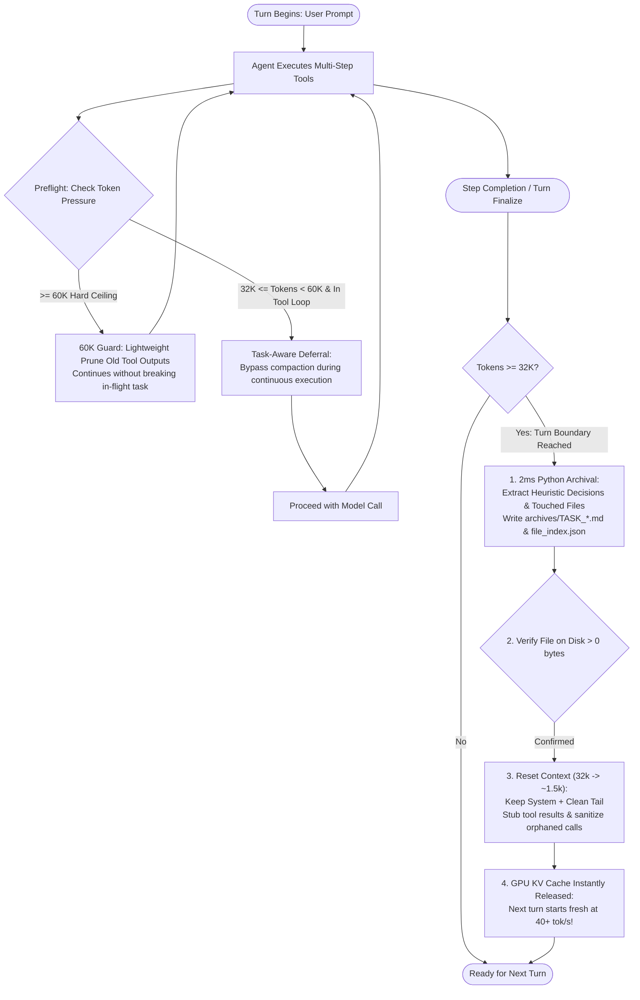

# 🚀 Context-Flusher

> **Task-Aware KV Cache Flushing & Zero-LLM Context Checkpointing Middleware for Local AI Agents**  
> *专为本地单卡大模型（llama.cpp / Ollama / vLLM）手写 Agent 循环打造的实用检查点、显存瞬清与文件级记忆检索中间件。*

[](LICENSE)
[](https://python.org)
[](#)
[](#)
[-success.svg)](#)

---

## 🎯 Positioning & Core Philosophy / 项目定位与工程哲学

**不搞虚假颠覆，只解决真实工程硬伤。**

在本地消费级显卡（RTX 3090/4090、Mac M系列芯片）上运行自主编程或多轮 Agent 时：
1. **显存与带宽掉速瓶颈**：随着工具日志和长代码累积，上下文膨胀到 30k~60k，显存带宽见顶，生成速度从 45+ tok/s 骤降到 10~15 tok/s，动辄触发 900s 超时；
2. **模型自总结的代价**：让本地 27B/32B 模型执行压缩总结，会卡死显卡 1~2 分钟，且容易抹掉关键的十六进制偏移、汇编代码和错误栈；
3. **记忆丢失的隐性陷阱**：盲目截断上下文会让 Agent 忘记前因后果（“为什么放弃方案 A 选择方案 B”），导致重复试错重做 20 分钟。

`Context-Flusher` 是一个轻量级（纯标准库 + PyYAML）、确定性（2ms 执行、0 额外模型开销）的本地中间件：
- **步骤收尾自动落盘**：多轮工具循环中不打断，步骤收尾时将全量事实落盘到 Markdown；
- **文件级倒排索引（`recall_by_file`）**：以修改的代码文件路径为锚点精准召回历史，解决自然语言同义词（“登录” vs “auth”）失效难题；
- **启发式决策捕获**：从回答尾部和“报错-重试”拓扑中提炼关键决策与避坑结论，零 LLM 也能留住核心意图；
- **工具调用桩降级（Tool Stubbing）**：将旧工具输出替换为执行桩而非物理抹除，杜绝模型因“失忆”而重复触发文件写入或数据库变更。

---

## 💡 Engineering Comparison / 核心机制对比

| Dimension / 维度 | ❌ Naive Context Truncation / 暴力截断 | ❌ Local LLM Summarization / 本地模型自压缩 | ✅ Context-Flusher / 本实用中间件 |
| :--- | :--- | :--- | :--- |
| **Compute Overhead / 算力开销** | 0 tokens | 消耗数千 tokens，单卡卡死 1~2 分钟 | **0 extra LLM tokens; 2ms Python 确定性执行** |
| **Why & Decision / 决策记忆** | 彻底丢失决策依据 | 理解好但耗时耗卡，易丢失关键数据 | **启发式抽取决策句 + 错误转向拓扑** |
| **Code Anchoring / 代码定位** | 无法定位 | 依赖模糊自然语言回忆 | **`recall_by_file` 按触碰文件精准索引** |
| **Side-effect Safety / 副作用安全** | 删除 tool_call 导致模型重复重试 | 无意图保护 | **Tool Stubbing: 保留调用意图，杜绝重复副作用** |
| **Protocol Safety / 协议合规** | 易引发 `400 Bad Request` | 需自己处理校验 | **ProtocolSanitizer 彻底杜绝 400 报错** |
| **Integration / 集成方式** | 大改代码 | 大改 Prompt 与控制流 | **`wrap_openai` 一行代码无侵入拦截包装** |

---

## 📈 The Sawtooth Performance Curve / 锯齿波性能示意

```text
  Context Tokens in Memory (上下文占用)
  60k |                               [60K Hard Ceiling: Lightweight Pruning]
      |                                      /\
  32k |         [Task End: Flush]           /  \           [Task End: Flush]
      |                /\                  /    \                 /\
      |               /  \                /      \               /  \
  1.5k|______________/____\______________/________\_____________/____\__________ Baseline Window
      +------------------------------------------------------------------------> Turns (对话轮次)
                         (Instant drop to ~1.5k post-archive)

  Inference Speed on Local GPU (推理速度 tok/s)
  50  |======================================================================== (Context-Flusher: Steady 40-45 tok/s)
  25  |
  10  |                \_______ (Without Flusher: Speed collapse to 12 tok/s & 900s timeout)
      +------------------------------------------------------------------------>
```

> 💡 **工程提示（关于 Prefix Caching）**：llama.cpp / vLLM 的 Prefix Caching 要求 System Prompt 前缀保持完全静态。Context-Flusher 严格确保首条 System Prompt 绝对前缀不被篡改，避免频繁清理引发 Prefill 重新计算。

---

## 🏗️ Workflow / 任务感知调度时序



---

## 📦 Quickstart / 快速上手

### 1. Installation / 安装
零重依赖，仅需 Python 3.9+ 与 PyYAML：

```bash
git clone https://github.com/your-username/context-flusher-engine.git
cd context-flusher-engine
pip install -e .
```

### 2. Method 1: 1-Line Non-Intrusive Wrapper (Recommended) / 一行代码无侵入接入
适用于手写 Agent 循环的开发者。使用 `wrap_openai` 包装原生客户端，后续所有的 `create` 调用自动享受预检拦截与原地上下文释放：

```python
from openai import OpenAI
from context_flusher import wrap_openai

# 1. 一行代码包装客户端（支持 llama-server / Ollama / vLLM / 官方 OpenAI）
client = wrap_openai(
    OpenAI(base_url="http://localhost:8080/v1", api_key="sk-local"),
    workspace_dir="./my_project",
    active_threshold=32000,   # 32k 活跃门限：任务进行中延迟，步骤收尾自动清理
    hard_ceiling=60000,       # 60k 兜底上限：仅对旧工具日志轻量折叠，绝不中断任务
)

messages = [{"role": "system", "content": "You are an autonomous engineering assistant."}]
messages.append({"role": "user", "content": "Reverse engineer target_driver.sys and generate patch"})

# 2. 原有调用完全不用改动！
# 当工具调用收尾且上下文超过 32k 时，messages 数组在原地自动回收至 ~1.5k！
response = client.chat.completions.create(model="qwen-2.5-coder", messages=messages)

# 3. 打印透明留存与损益对账单
stats = getattr(response, "context_flusher_stats", {})
print(client.format_flush_diff(stats))
```

### 3. Precision Recall by File / 文件级记忆精准召回（头号特色）
解决自然语言模糊搜索的同义词漂移问题：

```python
# 当 Agent 再次需要修改 target_driver.sys 时，直接根据文件路径调取记忆：
memory = client.recall_by_file("target_driver.sys")
if memory:
    print(f"上次修改任务: {memory['task_name']}")
    print(f"核心决策与避坑: {memory['decisions']}")
```

---

## 🛡️ Protocol Sanitizer & Tool Stubbing / 协议安全与意图桩

### 1. Tool Stubbing（避免重复副作用）
许多框架在裁剪历史时直接将 `role: tool` 消息物理删除。这会导致模型误以为自己“从未调用过该工具”，从而重复执行可能具有副作用的操作（如重写文件、重复跑数据库迁移）。

Context-Flusher 采用 **Tool Stubbing** 机制：
```json
// 原始 10,000 字符的工具日志：
{"role": "tool", "tool_call_id": "call_01", "content": "...10,000 characters..."}

// 降级为保留意图的极简执行桩：
{"role": "tool", "tool_call_id": "call_01", "content": "[Executed: output cleared (10,000 chars to preserve VRAM). Preview: PASSED test... ...]"}
```
- 模型明确知晓动作已成功完成；
- 显存空间释放 95% 以上；
- 100% 杜绝 `400 Bad Request`。

### 2. 悬挂调用检测与修复
对真正因异常中断产生的孤儿调用执行自动化修复：
```python
from context_flusher import ProtocolSanitizer

# 校验并清洗序列
safe_messages = ProtocolSanitizer.clean_and_validate(messages)
```

---

## 🎛️ Context Window Presets & Auto-Clamping / 上下文预设与服务端自适应

### 1. 严格以 Token 容量命名的预设
预设取决于模型 `n_ctx` 与 KV Cache 预算，而非物理显卡厂商型号：
- **`"8k"`**: `active_threshold: 8000`, `hard_ceiling: 14000`（适合小窗口或紧凑预算）
- **`"16k"`**: `active_threshold: 16000`, `hard_ceiling: 28000`（均衡型编程 Agent）
- **`"32k"`** (Default): `active_threshold: 32000`, `hard_ceiling: 60000`（主流推荐标准）
- **`"64k"`**: `active_threshold: 64000`, `hard_ceiling: 120000`（长文本深度规划）

### 2. 服务端 `n_ctx` 探测与等比自适应缩放（Server Clamping）
当用户配置的 `hard_ceiling >= server_n_ctx` 时，底层服务端会先报 OOM 或截断报错，导致清理器无机会执行。
`Context-Flusher` 具备自适应硬件防线：
- **轻量无感探测**：包装客户端时以 2.0s 严格超时探测 llama.cpp（`/props`）或 Ollama（`/api/show`），结果进程内持久缓存，失败静默放行，绝不阻断主链路；
- **等比保形缩放**：`hard_ceiling` 截断至 `n_ctx * 0.90`，`active_threshold` 按原有的 `active / ceiling` 比例等比下调，尊重用户自定义配置形状；
- **黄色警示指引**：终端输出明确提示 `建议检查服务端启动参数 --ctx-size 或 --n-ctx`；
- **双重兜底生效**：初始化与运行时 `set_thresholds` 均自动通过 `clamp_thresholds_to_n_ctx` 校验。

### 3. 严格四级参数生效优先级
```text
显式调用参数 (Explicit Args) > 环境变量 (Env Vars) > 配置文件 (config.yaml) > 预设与默认 (Presets/32k)
```

---

## 🚨 Emergency Escape Hatch / 紧急逃生舱机制

当发生死循环、第三方工具挂死或网络中断导致工具输出迟迟未返回，且上下文逼近 `hard_ceiling` 时：
1. **注入身份明确的紧急桩**：
   ```json
   {
     "role": "tool",
     "tool_call_id": "call_make_01",
     "content": "[System Alert: Tool 'execute_command' (args: {\"cmd\": \"make build\"}) execution status UNKNOWN - timed out or truncated before response. DO NOT assume side-effects completed without verification. Full call archived at: archives/TASK_*.md]"
   }
   ```
2. **拒绝盲猜**：工具函数名、参数预览、存盘指引三要素完整，模型下一轮可清晰判定失败并采取补救，而非面对匿名报错。
3. **诚实审计**：终端以 `[RED] EMERGENCY ESCAPE HATCH` 醒目对账单告警，全量事实已安全存盘。

---

## 📂 Project Structure / 项目结构

```text
context-flusher-engine/
├── context_flusher/
│   ├── __init__.py          # 导出 wrap_openai, ContextFlusher, clamp_thresholds_to_n_ctx 等
│   ├── engine.py            # 核心调度引擎、n_ctx 探测与等比缩放、对账单格式化
│   ├── wrapper.py           # 一行代码无侵入 OpenAI Client 包装器（支持 Prefix Cache 工具排序）
│   ├── sanitizer.py         # ProtocolSanitizer（协议防400、Tool Stubbing、Token估算）
│   ├── archiver.py          # 启发式决策抽取、触碰文件追踪与 2ms Markdown 归档
│   ├── context_reset.py     # KV Cache 瞬清与稳定前缀保护
│   └── retriever.py         # 文件倒排索引（recall_by_file / recall_by_dir）
├── tests/
│   └── test_engine.py       # 16 项全自动化测试套件（全部 PASS）
├── example_run.py           # 立即可跑的演示脚本（内置 MockClient，无需 API Key）
├── config.example.yaml      # 标准配置文件模板
├── pyproject.toml           # PEP 517/621 规范打包配置（MIT 协议）
├── requirements.txt         # 仅 pyyaml>=6.0
├── .gitignore               # Python 忽略规则
├── LICENSE                  # MIT License
└── README.md                # 实用导向的中英双语说明文档
```

---

## 🧪 Running Tests & Demo / 运行验证

```bash
# 运行开箱即用的完整实测案例（包含 Wrapper、recall_by_file、Tool Stubbing 演示）：
python example_run.py

# 运行 16 项全量单元与集成测试：
python tests/test_engine.py
```

---

## 📄 License / 开源协议

Released under the [MIT License](LICENSE). Copyright (c) 2026 Context-Flusher Contributors.  
遵循 MIT 开源许可协议，允许个人、商业及科研自由使用与集成。
