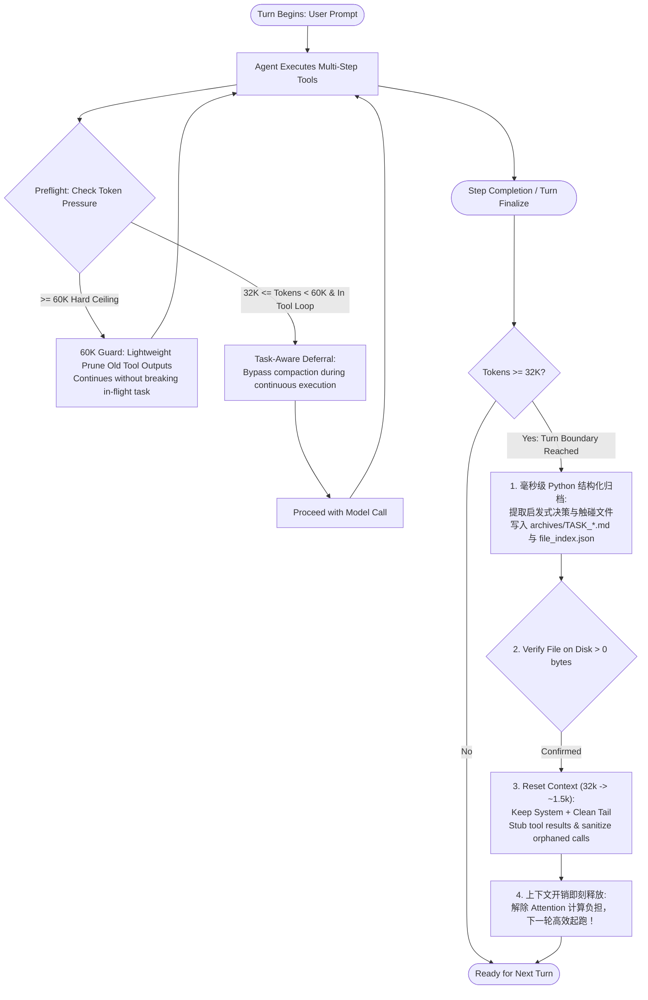

# 🚀 Context-Flusher

> **Task-Aware Context Compaction & Zero-LLM Checkpointing Middleware for Local AI Agents**  
> *专为本地大模型（llama.cpp / Ollama / vLLM）手写 Agent 循环打造的实用任务检查点、解码延迟治理与文件级精准记忆检索中间件。全平台支持 NVIDIA CUDA / AMD ROCm / Apple Silicon Metal / CPU。*

[](LICENSE)
[](https://python.org)
[](#)
[](#)
[-success.svg)](#)

---

## ⚡ The 5-Second Benchmark / 5 秒直观对比

在长程自主 Agent 循环中，上下文无节制膨胀会导致 Attention 掩码计算激增、显存带宽饱和，Token 生成速度大幅下滑：

```text
  Active Context Window (活动上下文占用)
  60k |                               [60K Hard Ceiling: Lightweight Prune]
      |                                      /\
  32k |         [Task End: Flush]           /  \           [Task End: Flush]
      |                /\                  /    \                 /\
      |               /  \                /      \               /  \
  1.5k|______________/____\______________/________\_____________/____\__________ Baseline Window (~1.5k)
      +------------------------------------------------------------------------> Turns (对话轮次)
                         (Instant drop to ~1.5k post-archive)

  Inference Speed on Local Hardware (解码生成速度走势示意)
  Steady |======================================================================== (Context-Flusher: 维持初始高速解码)
         |
  Drop   |                \_______ (Without Flusher: 随上下文拉长算力带宽见顶，速度可能显著下滑)
         +------------------------------------------------------------------------>
```

---

## 🚀 Quick Start / 快速上手（第一屏开箱即用）

### 1. 极简 4 行接入现有代码 (One-Line Wrapper)

无需改动现有 Prompt 控制流，一行代码完成无侵入代理拦截：

```python
from openai import OpenAI
from context_flusher import wrap_openai

# 1. 包装任意 OpenAI 兼容客户端 (llama-server / Ollama / vLLM)
raw_client = OpenAI(base_url="http://localhost:8080/v1", api_key="sk-local")
client = wrap_openai(raw_client, active_threshold=32000, hard_ceiling=60000)

# 2. 原有 Agent 循环调用完全不用变！
# 当任务步骤收尾且上下文超出门限时，messages 原地自动缩减至 ~1.5k，事实已安全落盘到 Markdown
response = client.chat.completions.create(model="qwen-2.5-coder", messages=messages)

# 3. 查看透明损益与对账单
stats = getattr(response, "context_flusher_stats", {})
print(client.format_flush_diff(stats))
```

### 2. 零依赖秒跑真实控制台演示 (Zero-Setup Demo)

无需下载大模型，无需启动后台服务，代码仓库自带完整 Mock 仿真环境：

```bash
git clone https://github.com/akayixiaoke/context-flusher-engine.git
cd context-flusher-engine
python example_run.py
```
> 💡 敲击回车即可直接在终端看到：**模拟 5,462 tokens 膨胀 ➔ 自动拦截存盘 ➔ 原地释放 95.8% 上下文 ➔ 毫秒级按文件精准召回决策**的完整全流程！

---

## 🎯 Positioning & Core Philosophy / 项目定位与工程哲学

**不搞虚假颠覆，诚实解决真实工程痛点。**

针对本地消费级显卡（NVIDIA RTX 30/40系列、AMD Radeon / ROCm、Apple Silicon Mac）与 CPU 环境手写 Agent 的开发者：
1. **不做自耗算力的“模型自我压缩”**：本地 27B/32B 模型跑总结会卡死显卡 1~2 分钟，且极易遗漏关键十六进制地址、汇编代码和错误堆栈；
2. **不搞笨重的向量数据库 RAG**：代码变更和工程决策以触碰的文件路径为锚点（`recall_by_file`），利用轻量倒排索引，毫秒级精准命中；
3. **杜绝“物理删除”引发的重复副作用**：清理历史时保留调用桩（Tool Stubbing），模型知道“这个操作已经执行过了”，绝不重复写文件或删库；
4. **全平台全硬件通用**：NVIDIA CUDA、AMD ROCm、Apple Metal 或纯 CPU 环境，只要运行标准的 OpenAI 兼容服务端，均可开箱即用。

---

## 💡 Engineering Comparison / 核心机制对比

| Dimension / 维度 | ❌ Naive Context Truncation / 暴力截断 | ❌ Local LLM Summarization / 本地模型自压缩 | ✅ Context-Flusher / 本实用中间件 |
| :--- | :--- | :--- | :--- |
| **Compute Overhead / 算力开销** | 0 tokens | 消耗数千 tokens，单卡卡死 1~2 分钟 | **0 extra LLM tokens; 毫秒级 Python 确定性执行** |
| **Hardware Support / 硬件兼容** | 通用 | 依赖高端显卡算力 | **全平台通用（NVIDIA / AMD / Apple / CPU）** |
| **Why & Decision / 决策记忆** | 彻底丢失决策依据 | 理解好但耗时耗卡，易丢失关键数据 | **启发式抽取决策句 + 错误转向拓扑 [Experimental]** |
| **Code Anchoring / 代码定位** | 无法定位 | 依赖模糊自然语言回忆 | **`recall_by_file` 按触碰文件倒排索引** |
| **Side-effect Safety / 副作用安全** | 删除 tool_call 导致模型重复重试 | 无意图保护 | **Tool Stubbing: 保留调用意图，杜绝重复副作用** |
| **Protocol Safety / 协议合规** | 易引发 `400 Bad Request` | 需自己处理校验 | **ProtocolSanitizer 从机制上消除修剪引入的 400 报错** |
| **Prefix Cache / 前缀缓存** | 随意修改导致缓存频繁击穿 | 难以保持一致性 | **锁定 System Prompt 首条静态前缀，字典序 Pinning 工具** |

---

## 🏗️ Workflow / 任务感知调度时序



---

## 🔍 Feature Deep Dive / 特性详解

### 1. 文件级记忆精准召回（Precision Recall by File）
解决自然语言模糊搜索的同义词漂移问题（例如搜索“登录”漏掉“auth”）：

```python
# 当 Agent 再次需要修改 target_driver.sys 时，直接根据文件路径调取精准历史卡片：
memory = client.recall_by_file("target_driver.sys")
if memory:
    print(f"上次修改任务: {memory['task_name']}")
    print(f"核心避坑决策: {memory['decisions']}")

# 亦支持按目录模块整体召回：
dir_history = client.recall_by_dir("src/auth")
```

### 2. Tool Stubbing 执行桩降级（杜绝重复副作用）
许多框架清理上下文时直接物理删除 `role: tool` 消息。这会导致模型误以为自己“从未执行过该操作”，从而重复执行可能产生破坏性副作用的动作（如反复写入文件、跑数据库重构）。

Context-Flusher 采用 **Tool Stubbing** 机制：
```json
// 原始 10,000 字符的工具日志：
{"role": "tool", "tool_call_id": "call_01", "content": "...10,000 characters..."}

// 降级为保留意图的极简执行桩（以实际代码输出为准）：
{"role": "tool", "tool_call_id": "call_01", "content": "[System: Action 'write_file' executed. Result recorded (10,000 chars). DO NOT repeat execution. Full output archived to disk. Preview: ... ]"}
```
- 模型明确知晓动作已成功完成，绝不无故重做；
- 避免冗余长文本消耗解码带宽；
- 从机制上彻底消除孤儿调用引起的 `400 Bad Request` 报错。

### 3. 上下文容量自适应缩放（Server Clamping）
当用户配置的 `hard_ceiling >= server_n_ctx` 时，底层服务端会先报溢出，导致清理器无机会执行。
`Context-Flusher` 具备自适应硬件防线：
- **轻量探针**：2.0s 严格超时探测 llama.cpp（`/props`）或 Ollama（`/api/show`），进程内持久缓存，失败静默放行；
- **等比保形缩放**：`hard_ceiling` 截断至 `n_ctx * 0.90`，`active_threshold` 按原有的 `active / ceiling` 比例等比缩小，尊重用户配置形状；
- **双重兜底生效**：初始化与运行时 `set_thresholds` 均自动校验，并输出改进建议。

### 4. 紧急逃生舱机制（Emergency Escape Hatch）
当发生死循环或第三方工具超时卡死，上下文逼近硬顶时，自动注入带工具函数名、参数截断预览与存盘路径的实体桩：
```text
[System Alert: Tool 'execute_command' (args: {"cmd": "make build"}) execution status UNKNOWN - timed out or truncated before response. DO NOT assume side-effects completed without verification. Full call archived at: archives/TASK_*.md]
```
终端以 `[RED] EMERGENCY ESCAPE HATCH` 对账单醒目告警，下一轮模型可清晰判定哪一步受挫并采取补救。

---

## ⚠️ Limitations & Honest Disclosures / 局限性与诚实声明

作为坚持“不搞虚假颠覆、诚实解决工程痛点”的实用工具，在集成使用前请知悉以下技术边界：

1. **无语义理解 (No Semantic Understanding)**：归档决策抽取与文件定位完全基于确定性的正则表达式、字符拓扑与状态机规则，不消耗额外模型推理，因此无法理解深层语义泛化。
2. **关键词与路径级索引 (Path & Inverted Indexing)**：`recall_by_file` 与 `recall_by_dir` 基于轻量级 JSON 倒排索引文件（`file_index.json`），专为代码文件路径精准回查设计，不替代具备向量 Embedding 的复杂 RAG 知识库。
3. **启发式决策抽取仍属实验性 (Heuristic Extraction is Experimental)**：从助手推理尾部提炼的“避坑决策”目前定义为“候选建议（Candidate Rules）”，在极其复杂或非常规提示词工程下仍需持续验证与调优。
4. **显存预分配机制说明 (VRAM Allocation Note)**：`llama.cpp` 与 `Ollama` 的 KV Cache 往往按 `n_ctx` 预占显存，本工具优化的是**每步解码计算量、生成延迟与上下文可用预算**，不会改变底层 `nvidia-smi` 或 `rocm-smi` 的物理静态显存分配数值。

---

## 📂 Project Structure / 项目结构

```text
context-flusher-engine/
├── context_flusher/
│   ├── __init__.py          # 导出 wrap_openai, ContextFlusher, clamp_thresholds_to_n_ctx 等
│   ├── engine.py            # 核心调度引擎、n_ctx 探测与等比缩放、对账单格式化
│   ├── wrapper.py           # 一行代码无侵入 OpenAI Client 包装器（支持 Prefix Cache 工具排序）
│   ├── sanitizer.py         # ProtocolSanitizer（协议防400、Tool Stubbing、Token估算）
│   ├── archiver.py          # 启发式决策抽取[Experimental]、触碰文件追踪与毫秒级 Markdown 归档
│   ├── context_reset.py     # 上下文修剪与稳定前缀保护
│   └── retriever.py         # JSON 倒排索引（recall_by_file / recall_by_dir）
├── tests/
│   └── test_engine.py       # 18 项全自动化测试套件（全部 PASS）
├── example_run.py           # 立即可跑的演示脚本（内置 MockClient，无需 API Key）
├── config.example.yaml      # 标准配置文件模板（纯 Token 预设划分）
├── pyproject.toml           # PEP 517/621 规范打包配置（MIT 协议）
├── requirements.txt         # 仅 pyyaml>=6.0（真正的零重依赖）
├── .gitignore               # Python 忽略规则
├── LICENSE                  # MIT License
└── README.md                # 诚实导向的中英双语说明文档
```

---

## 🧪 Running Tests & Demo / 运行验证

```bash
# 1. 运行开箱即用的完整实测案例（包含 Wrapper、recall_by_file、Tool Stubbing 演示）：
python example_run.py

# 2. 运行 18 项全量单元与集成测试（毫秒级全绿）：
python tests/test_engine.py
```

---

## 📄 License / 开源协议

Released under the [MIT License](LICENSE). Copyright (c) 2026 Context-Flusher Contributors.  
遵循 MIT 开源许可协议，允许个人、商业及科研自由使用与集成。
